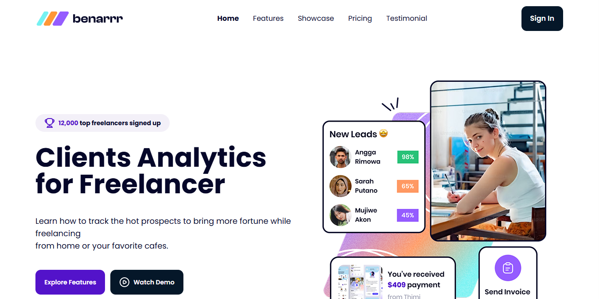

# Benarrr – Landing Page Project

This is a responsive landing page project built using Tailwind CSS. It was created as part of a learning program in a Tailwind class by BuildWithAngga.

## 🚀 Live Demo

[View Live Demo](https://benarrrfinance.netlify.app/)

## 📸 Preview

## 📊 Project Overview

This project replicates a landing page design provided in Figma during the course. The objective was to practice implementing UI/UX designs using Tailwind CSS utilities and responsive layout techniques.

## 🌟 Key Features

- Responsive layout across devices
- Clean and modern design
- Built with semantic HTML and Tailwind CSS

## 📚 Technologies Used

- HTML5
- Tailwind CSS v3.4.1

## 🔹 Credits

- Design reference: Figma UI from BuildWithAngga
- Developer: Alip Saefulloh

This project is for educational purposes only and is a part of my journey to become a Front-End Developer.